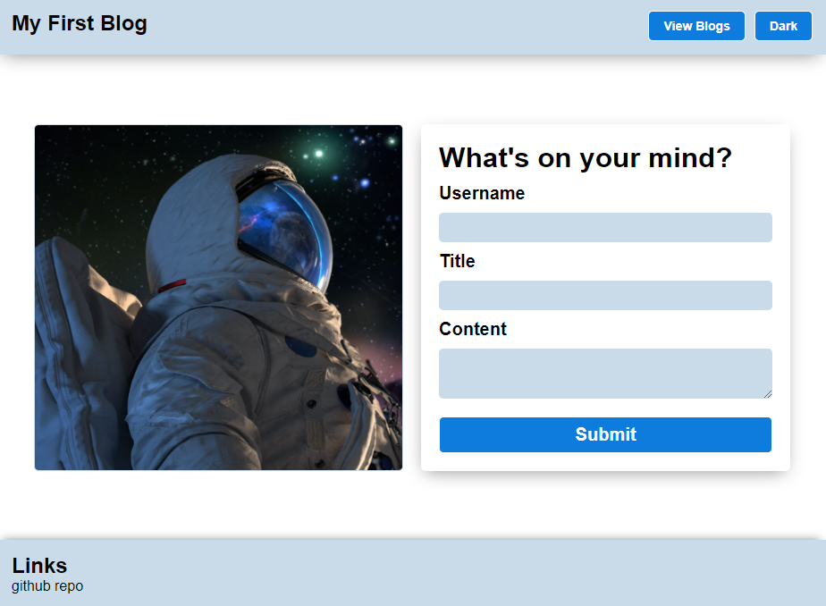

# BCS-blog-brian-storm

Welcome to our two-page blog site! This simple yet powerful platform allows you to create and view blog posts seamlessly. 

## Features

### Page 1: Create Post

- **Button to View All Posts**: Navigate to the second page to view all blog posts.
- 
- **Dark Theme Toggle Button**: Switch between light and dark themes.
- 
- **Create Post Form**: Submit your blog posts with a title and content input fields.
- 
- **Footer**: Find a link to the repository for this project.

### Page 2: View Posts

- **Display Posts**: All blog posts are fetched from local storage and displayed here.
- 
- **Delete Post Button**: Remove individual posts with ease.
- 
- **Delete All Posts Button**: Clear out the entire post history with a single click.

## Local Storage

Both the theme preference and blog post data are stored locally.

## Author 

Carlos Febres

